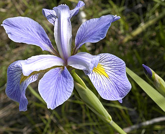

# Demonstrating classification algorithms on the Iris data set

Author: David Dvorak

Date: July 2021

This classification demonstration will make use of the Iris data set created by R. A. Fisher. This classic data set provides 4 features of the 3 classes of Iris flower: setosa, virginica and versicolor. One class is linearly separable while the other two classes are not linearly separable. The goal of this demonstration is show how to implement and compare the performance of different supervised and unsupervised classification algorithms.

Iris Setosa |  Iris Virginica |  Iris Versicolor
:-------------------------:|:-------------------------:|:-------------------------:
 |  | 

The four features in this data set are sepal length, sepal width, petal length and petal width. We can see in the pair plot below that these features are correlated with each other to varying degrees depending on the species of Iris.

In this Jupyter Notebook I use 5 different algorithms to try and predict the species of Iris flower based on the four features of the data. The algorithms I consider are logistic regression, K means, K nearest neighbours, support vector  and gaussian naive bayes classification. The accuracy scores for each algorithm are as follows:

We can see that each of the selected classificatino algorithms performs quite well on the small Iris data set. The K-means clustering algorithm performed the poorest and the K-nearest neighbours algorithm performed the best. Hopefully this has been a helpful overview of how to apply a range of algorithms to classify data.