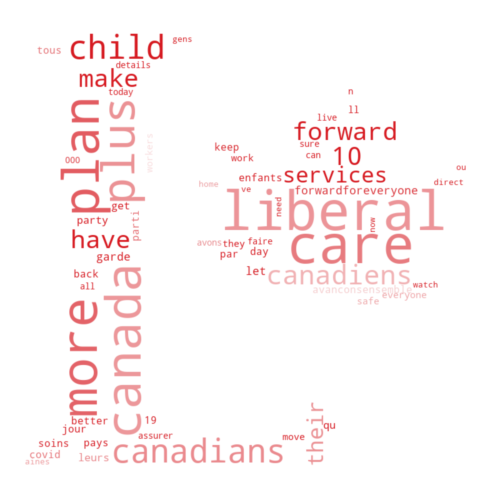
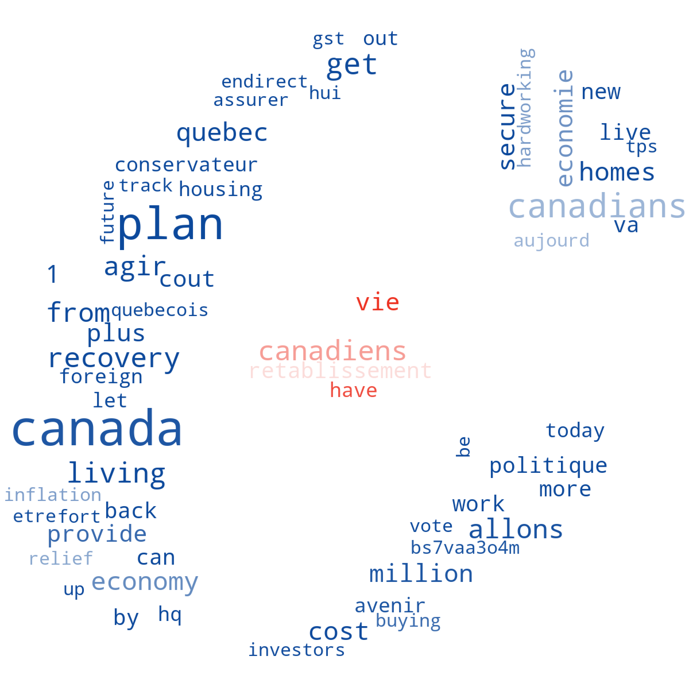
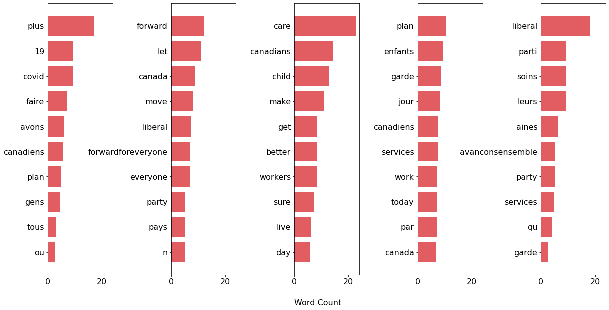
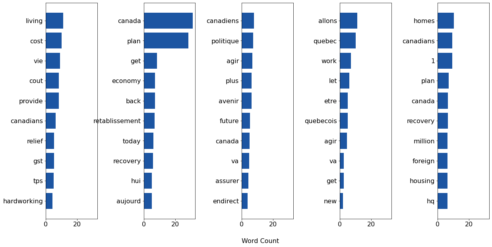

# Topic Analysis and Word Frequency Visualization of Canadian Federal Liberal and Conservative Party Leaders' Tweets

Author: David Dvorak

Date: August 21, 2021

Here I generate word clouds based on the frequency of words in recent tweets by Justin Trudeau (Prime Minister and leader of the Liberal Party of Canada) and Erin O'Toole (leader of the Conservative Party of Canada) in the first week of the 2021 federal election. Please see the Jupyter notebook for the code used to generate the following visuals. The code for the tweet collection is located in twitter_user_dump_2021.py and it utilizes the tweepy package.

I also visualize the results of the topic analysis using pyLDAvis. I am following the structure of the example at http://nbviewer.jupyter.org/github/bmabey/pyLDAvis/blob/master/notebooks/sklearn.ipynb
which utilitzes the pyldavis package: https://github.com/bmabey/pyLDAvis. Since the interactive visualizations are not displayable here, I will plot the top 10 words in each topic, as assigned by the LDA algorithm.

Here are the 5 topics to which Justin Trudeau's tweets were assigned:

And here are the 5 topics to which Erin O'Toole's tweets wer assigned:

